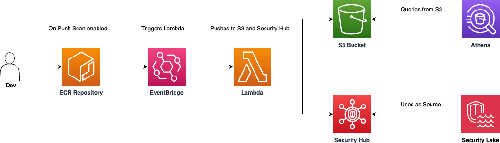

# ECR Scan Results

> [!CAUTION]
> This is only a POC this is not meant to run in production, run it at your own risk. When cloning the repo or copying the files you become fully liable for any impact

Small POC to showcase how to send ECR Basic Scan restuls to Security Hub and S3. Athena is used to query S3



## Deploy

```
cdk deploy
```

## Some Athena queries

```
SELECT
    id,
    detail_type,
    source,
    time,
    repository_name,
    image_digest,
    scan_status,
    severity_undefined,
    severity_low,
    severity_medium,
    severity_high,
    severity_critical,
    image_tags,
    split(image_tags, '|') AS image_tags_array
FROM ecr_scan_results
LIMIT 5;
```

```
SELECT *
FROM ecr_scan_results
WHERE date_parse(time, '%Y-%m-%dT%H:%i:%sZ') > current_date - interval '7' day
ORDER BY time DESC;
```

```
SELECT
    repository_name,
    AVG(severity_undefined) AS avg_undefined,
    AVG(severity_low) AS avg_low,
    AVG(severity_medium) AS avg_medium,
    AVG(severity_high) AS avg_high,
    AVG(severity_critical) AS avg_critical
FROM ecr_scan_results
GROUP BY repository_name;
```
